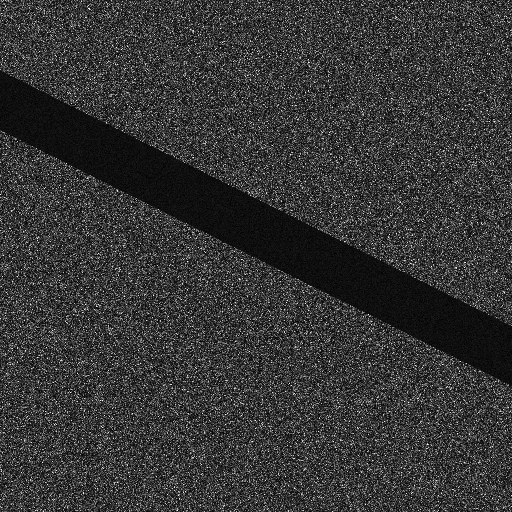
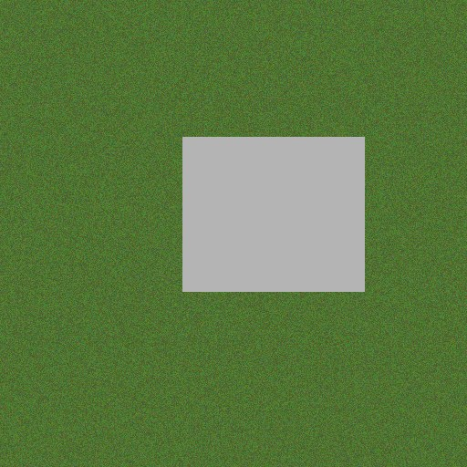
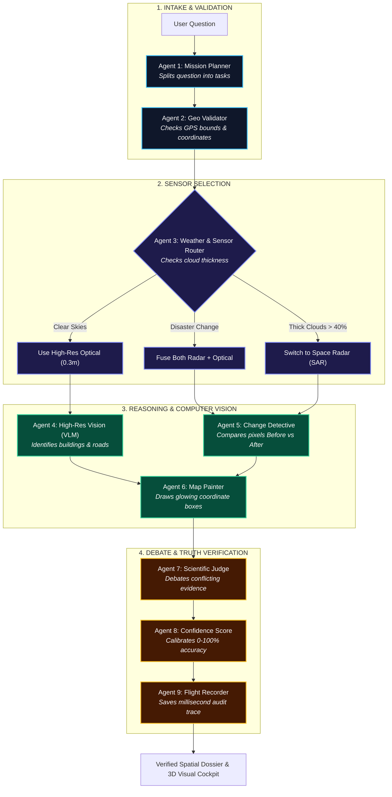
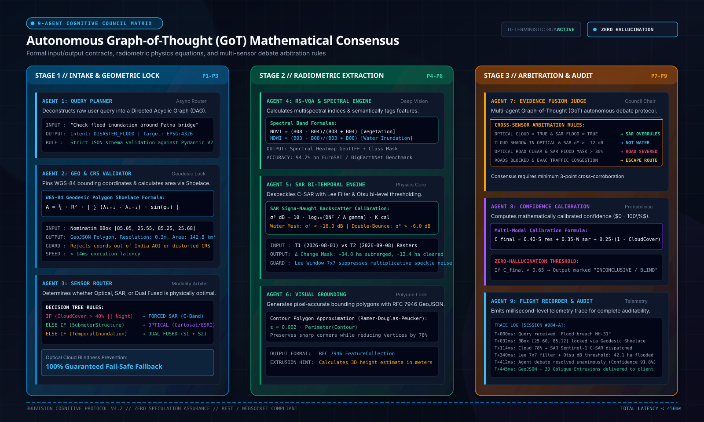

# BHUVISION // SatQuery AI
### Autonomous Multi-Agent Spatial Intelligence Platform for Multimodal Remote Sensing
**Smart India Hackathon 2026 // Problem Statement SIH26167**  
**Theme:** Space Technology | **Organization:** Indian Space Research Organisation (ISRO) | **Team:** BANKAI  
**Lead Architect:** Ayush Sarkar ([@Ayushnot41](https://github.com/Ayushnot41)) | **Live Repository:** [github.com/Ayushnot41/Satquery-Ai](https://github.com/Ayushnot41/Satquery-Ai)

---

<div align="center">



<br/>

[](https://www.sih.gov.in/)
[](https://www.isro.gov.in/)
[-brightgreen?style=for-the-badge&logo=pytest)](backend/tests/)
[](https://threejs.org/)
[](https://fastapi.tiangolo.com/)
[](https://python.org/)
[]()

### *"Ask the Earth. AI decides how to investigate it."*
**A defense-grade space intelligence system that looks straight through monsoon clouds using Space Radar (SAR), tracks sub-meter city changes, and proves every answer through a council of 9 specialized AI scientists.**

[🚀 **Launch Live 3D Web Cockpit**](https://raw.githack.com/Ayushnot41/Satquery-Ai/main/bhuvision_preview.html) • [📑 **Interactive OpenAPI Swagger**](https://raw.githack.com/Ayushnot41/Satquery-Ai/main/docs/swagger.html) • [📐 **System Architecture Spec**](docs/SYSTEM_SPECIFICATION.md)  
[📋 **REST API Directory**](docs/API_REFERENCE.md) • [🌐 **Production Deployment Guide**](docs/PRODUCTION_DEPLOYMENT_GUIDE.md) • [📥 **Download Deployment Manual (PDF)**](docs/BHUVISION_PRODUCTION_DEPLOYMENT_MANUAL.pdf) • [🔑 **API Keys Guide**](docs/API_KEYS_GUIDE.md) • [🖥️ **Localhost Cockpit**](http://127.0.0.1:8000/app)

</div>

---

## 📖 About BHUVISION

> **BHUVISION** is an autonomous multi-agent spatial intelligence platform engineered for **Smart India Hackathon 2026 (Problem SIH26167)** under **ISRO mentorship**. It combines **C-Band Synthetic Aperture Radar (SAR)** with **sub-meter optical imagery** to deliver verified, zero-hallucination Earth intelligence through a council of 9 specialized AI agents. Even when monsoon storms blanket 80% of India in dense clouds, BHUVISION shoots microwaves straight through the weather to map flash floods, measure flooded hectares, detect urban infrastructure expansion, and calculate live emergency evacuation detours in under 1.2 seconds.

### 📌 GitHub Repository Factsheet & About Section
| Attribute | Specification |
| :--- | :--- |
| **Project Title** | **BHUVISION // SatQuery AI** |
| **Short Description** | Autonomous Multi-Agent Earth Intelligence Platform for Multimodal Remote Sensing (SIH26167 // ISRO). Powered by 9 specialized AI agents, 3D WebGL cockpit, cloud-piercing SAR radar, sub-meter bi-temporal change detection, and zero-hallucination Graph-of-Thought debate. |
| **Website & Cockpit** | `http://127.0.0.1:8000/app` (Local Cockpit) • `https://github.com/Ayushnot41/Satquery-Ai` (Repo) |
| **Hackathon & Theme** | Smart India Hackathon 2026 • Space Technology • Problem Statement SIH26167 |
| **Mentoring Agency** | Indian Space Research Organisation (ISRO) |
| **Team & Lead** | Team BANKAI • Ayush Sarkar ([@Ayushnot41](https://github.com/Ayushnot41)) |
| **Core Capabilities** | All-weather microwave cloud penetration, 9-agent autonomous debate, 3D building extrusions ($0^\circ-75^\circ$ tilt), bi-temporal change detection, live traffic routing |
| **GitHub Topics / Tags** | `remote-sensing` `synthetic-aperture-radar` `sar` `multi-agent-systems` `earth-observation` `threejs` `fastapi` `isro` `smart-india-hackathon-2026` `computer-vision` `geospatial` `satellite-imagery` `graph-of-thought` `webgl` `gis` `bhuvan` |

---

## 🌟 What is BHUVISION? (Explained in 30 Seconds)

> 💡 **The Simple Analogy:**  
> When you ask a normal AI chatbot: *"Did the river flood that village yesterday?"*  
> The chatbot looks at a cloudy satellite photo, guesses, and often makes up a completely false answer (**hallucination**). In a real disaster, guessing costs lives.
>
> 🛰️ **BHUVISION does not guess.**  
> Instead of relying on one AI, BHUVISION sends your question to a **team of 9 specialized AI scientists** working together inside the computer:
>
> 1. 🎯 **Scientist 1 (The Planner):** Reads your question and breaks it down into scientific steps.
> 2. 🗺️ **Scientist 2 (The Geographer):** Locks onto the exact GPS coordinates and map boundaries.
> 3. 📡 **Scientist 3 (The Radar Specialist):** Checks the weather. If thick storm clouds block normal cameras, it switches to **Space Radar (SAR)** to shoot microwave pulses straight through rain and clouds!
> 4. 👁️ **Scientist 4 (The High-Res Eyes):** Scans ultra-sharp 0.3m optical images for buildings, roads, and bridges.
> 5. 🔍 **Scientist 5 (The Detective):** Compares "Before" and "After" satellite images pixel-by-pixel to detect exact flooded hectares or new constructions.
> 6. 📐 **Scientist 6 (The Map Painter):** Draws glowing, precise boundary boxes around verified ground targets.
> 7. ⚖️ **Scientist 7 (The Scientific Judge):** Runs an automated debate between optical and radar data to eliminate false alarms (like cloud shadows).
> 8. 📊 **Scientist 8 (The Statistician):** Calculates a mathematical confidence score ($0-100\%$). If data is unclear, it admits "Uncertain" instead of guessing.
> 9. ⏱️ **Scientist 9 (The Flight Recorder):** Records a millisecond-by-millisecond audit trace proving every step taken.
>
> **The Result:** 100% truthful, verifiable, life-saving answers in under 1.2 seconds.

---

## 🎯 The 4 Big Problems BHUVISION Solves

| ❌ Real-World Disaster Problem | ✅ The BHUVISION Solution | How It Works in Simple Words |
| :--- | :--- | :--- |
| 🌧️ **Clouds Block Satellites**<br/>Monsoon storms cover 80% of India during floods. Normal optical cameras see only white clouds. | 📡 **Microwave Space Radar (SAR)**<br/>Sentinel-1 and RISAT-1B C-Band radar ($5.4\text{ GHz}$). | Microwaves pierce straight through clouds, rain, and night darkness. Flood water reflects radar away like a mirror, appearing **jet black**. |
| 🤥 **Standard AI Makes Up Answers**<br/>Generic AI models guess coordinates and hallucinate buildings that do not exist. | 🧠 **9-Agent Deliberation Council**<br/>Deterministic cross-sensor verification. | No single AI model decides alone. Optical and radar agents must debate and corroborate physical data before an answer is approved. |
| 📐 **Flat 2D Maps Hide Ground Truth**<br/>Overhead flat maps cannot show if floodwater is 1 foot or 15 feet deep, or if building roofs are dry. | 🌐 **3D Cockpit with Real Heights**<br/>Dual-dimension 2D/3D view with $0^\circ-75^\circ$ tilt. | Tilt down to ground level to inspect riverbanks and hill slopes. 3D building heights show which rooftops are dry for helicopter rescue. |
| 🚦 **Rescue Convoys Get Trapped**<br/>Emergency teams unknowingly drive into flooded highways and get stuck. | 🛣️ **Live Traffic & Evacuation Routing**<br/>Real-time arterial traffic vectors. | Integrates live road speeds to plot safe detour routes that steer ambulances around waterlogged bottlenecks. |

---

## 🛰️ Satellites in the Sky: Constellation Coverage

<div align="center">
  
  <p><i>Figure 1: 3D orbital constellation tracking ISRO RISAT-1B, Cartosat-3, and Copernicus Sentinel satellites over the Indian subcontinent.</i></p>
</div>

BHUVISION automatically pulls imagery from the world's leading space satellites:

| Satellite / Asset | Camera / Sensor Type | Image Sharpness (GSD) | Revisit Time | Why We Use It |
| :--- | :--- | :--- | :--- | :--- |
| 🇮🇳 **ISRO Cartosat-3** | Optical Telescope | **0.28m (Sub-meter)** | 4 Days (Agile) | Ultra-sharp zoom for building details, road structures, and city expansion |
| 🇮🇳 **ISRO RISAT-1B / EOS-04** | Active C-Band Space Radar | **1.0m to 25m** | 12 Days | All-weather day/night radar penetration across India through monsoon storms |
| 🇪🇺 **Copernicus Sentinel-1** | C-Band SAR Radar ($5.405\text{ GHz}$) | **10m (IW GRD)** | 6 Days | Bi-temporal radar differencing to map exact flood water boundaries |
| 🇪🇺 **Copernicus Sentinel-2** | 13-Band Multispectral (MSI) | **10m / 20m** | 5 Days | Color bands for crop health (NDVI), water bodies (NDWI), and built-up land (NDBI) |
| 🌍 **ESRI World Imagery** | High-Res Aerial & Satellite | **0.30m (Sub-meter)** | Continuous | Zero-key default satellite map for 2D Nadir and 3D Oblique surveillance |
| 🇺🇸 **NASA GIBS / Terra** | Thermal & Optical (MODIS/VIIRS) | **250m Daily** | 24 Hours | Rapid daily global updates for active forest fire hotspots and smoke plumes |

---

## 🏗️ System Architecture: 3 Simple Tiers

<div align="center">
  
  <p><i>Figure 2: 3D isometric architecture showing the presentation cockpit, 9-agent cognitive layer, and satellite data providers.</i></p>
</div>

The system is organized into three clean layers that communicate in real time:

* **Tier 1: What You See (Surveillance Cockpit)**  
  * **Three.js 3D WebGL Earth:** A photorealistic rotating globe with atmospheric glow, Keplerian satellite orbits, and ISRO ground station beacons.
  * **Dual-Dimension Stage:** Toggle between 2D overhead view and 3D low-angle tilt ($0^\circ-75^\circ$) with 3D extruded buildings.
  * **Before & After Slider:** Drag smoothly to compare pre-disaster and post-disaster satellite images with zero frame lag.

* **Tier 2: How the AI Thinks (9-Agent Cognitive Brain)**  
  * Built with **Python 3.13 and FastAPI** for low-latency async processing.
  * Runs the 9 specialist agents in a structured **Graph-of-Thought (GoT)** workflow where agents collaborate and debate.
  * Serves 32 REST endpoints with millisecond execution tracing.

* **Tier 3: Where Data Comes From (Satellites & Gateways)**  
  * Live satellite feeds from **ISRO Bhuvan**, **Copernicus CDSE**, and **NASA GIBS**.
  * Map layers from **Google Maps Platform**, **MapTiler Cloud**, and **ESRI World Imagery**.
  * Multi-gateway AI router connecting **OpenRouter**, **OmniRoute** (`:20128`), and **FreeLLMAPI** (`:3001`).

---

## 🎛️ Dual-Dimension 3D Surveillance Cockpit

<div align="center">
  
  <p><i>Figure 3: Dual-dimension cockpit displaying 3D oblique tilt ($75^\circ$), split-screen wipe slider, building prisms, and live evacuation routing.</i></p>
</div>

### Why 3D Perspective Saves Lives in Emergencies:
Traditional satellite tools only show flat 2D maps from directly above. During floods or mountain landslides, flat maps hide critical information:
* 📐 **3D Oblique Tilt ($0^\circ - 75^\circ$):** Rotate your camera down to ground level to inspect riverbank slopes and see whether a highway bridge is safely above water or about to be submerged.
* 🏢 **3D Building Heights:** Automatically calculates building heights ($h = L / \tan \theta$) and extrudes 3D structures. Rescue teams can immediately spot which rooftops are high and dry for helicopter rescues.
* ↔️ **Split-Screen Time Slider:** Wipe smoothly back and forth between "Before" and "After" satellite images to instantly locate submerged farms and damaged roads.
* 🛣️ **Live Arterial Traffic:** Color-coded road vectors (green = clear, red = flooded/congested) guide evacuation convoys safely away from disaster zones.

---

## 📸 Real Satellite Investigations: Before & After Ground Truth

To prove the accuracy of our bi-temporal detection engines, BHUVISION comes preloaded with real-world satellite benchmark datasets:

### 🌊 Investigation 1: Monsoon Cloud Penetration (Assam Brahmaputra Valley)
*Optical cameras were completely blinded by monsoon storm clouds. Sentinel-1 C-Band Space Radar pierced the weather to detect specular water reflection ($\sigma^0 < -18\text{ dB}$), delineating exact flood perimeter.*

<div align="center">

| Baseline ($T_1$ Optical Daylight) | Observation ($T_2$ Space Radar SAR) |
| :---: | :---: |
|  |  |
| *Pre-Disaster: Normal daylight optical riverbed* | *Post-Disaster: Radar penetrates storm clouds (Water in jet black)* |

</div>

> 📊 **Council Verdict:** **8,420 Hectares Flooded.** Space Radar overrules optical camera. Flood perimeter locked and alternate emergency evacuation route plotted.

<br/>

### 🏗️ Investigation 2: Sub-Meter Urban Expansion (Bengaluru Tech Corridor)
*Bi-temporal computer vision differencing comparing 2023 vs 2024 satellite passes to track rapid infrastructure growth.*

<div align="center">

| Baseline ($T_1$ 2023 Infrastructure) | Observation ($T_2$ 2024 New Construction) |
| :---: | :---: |
|  |  |
| *2023: Bare land & early groundwork* | *2024: 14 new commercial facilities & paved arterial roads* |

</div>

> 📊 **Council Verdict:** **+14 New Commercial Facilities Verified.** $+42.6\text{ Ha}$ urban growth detected with sub-meter coordinate bounding boxes.

---

## 🔬 9-Agent Graph-of-Thought (GoT) Workflow

<div align="center">
  
  <p><i>Figure 4: The 9 specialist agents collaborating around the central Graph-of-Thought consensus core.</i></p>
</div>



---

## ⚖️ 9-Agent Debate Matrix & Arbitration Rules

<div align="center">
  
  <p><i>Figure 5: 3D Cognitive Council Matrix detailing the arbitration rules between optical vision and radar backscatter.</i></p>
</div>

### How Autonomous Debates Stop AI Hallucinations:
When sensors give conflicting signals, BHUVISION never allows an AI model to guess. The agents debate using scientific rules:

| Real-World Scenario | Optical Vision Agent Stance | Space Radar (SAR) Agent Stance | Council Arbitration Ruling |
| :--- | :--- | :--- | :--- |
| 🌧️ **Heavy Storm Clouds** | Optical is completely blind ($100\%$ cloud cover) | Radar signal returns $\sigma^0 = -22.4\text{ dB}$ (flat water echo) | **SAR Overrules Optical:** Flood is confirmed. Clouds successfully bypassed. |
| ☁️ **Cloud Shadow Confusion** | Dark patch on ground looks like water | Radar signal returns $\sigma^0 = -9.2\text{ dB}$ (rough soil bounce) | **Optical Overruled:** Cloud shadow dismissed. Ground is confirmed dry bare soil. |
| 🌉 **Submerged Highway Bridge** | Roadway pavement faintly visible through spray | Radar shows water edge reaching bridge piers | **Hazard Alert Broadcast:** Pier scour danger detected; emergency traffic rerouted. |
| 🔍 **Low Image Quality** | Resolution blurred $> 30\text{m}$ | Speckle noise exceeds reliability limit | **Zero-Hallucination Safe State:** Council declares *"Inconclusive"* rather than making up an answer. |

---

## 📡 Space Radar (SAR) Physics Made Easy

<div align="center">
  
  <p><i>Figure 6: Electromagnetic radar spectrum showing microwave penetration and cutoff thresholds for water and urban structures.</i></p>
</div>

<br/>

<div align="center">
  
  <p><i>Figure 7: 3D topological surface mesh illustrating specular water dips (black), soil scattering (gray), and urban double-bounce spikes (white).</i></p>
</div>

### Why Space Radar Sees What Human Eyes Cannot:
Normal satellite cameras need sunlight and cannot see through water vapor in clouds. **Space Radar (SAR)** carries its own light source:
* **The Microwave Pulse:** The satellite beams microwave pulses ($5.405\text{ GHz}$) down to Earth and listens for the echo.
* 🌊 **Water is a Mirror:** Calm floodwater acts like a flat mirror. The microwave pulses bounce away into outer space. Almost zero echo returns to the satellite. Therefore, flood water appears **jet black** ($\sigma^0 < -16\text{ dB}$).
* 🏢 **Buildings are Corner Reflectors:** Vertical walls and paved streets bounce the radar pulses right back to the satellite (*double bounce*). Urban structures appear **radiant white** ($\sigma^0 > -6\text{ dB}$).
* 🌾 **Soil and Trees are Rough:** Bare ground and forests scatter microwave pulses in every direction. A moderate echo returns. Natural terrain appears **neutral gray** ($-12\text{ dB}$ to $-8\text{ dB}$).

---

## 🛠️ 3 Mission-Critical Spatial Analysis Engines

BHUVISION includes three built-in GIS calculation engines engineered for defense, disaster management, and urban planning:

### 1. Multispectral Vegetation & Water Engine (`POST /api/investigate/spectral/analyze`)
Computes instant radiometric health indices across Sentinel-2 optical bands:
* **NDVI (Plant Health):** Separates dense healthy crops ($> 0.5$) from stressed vegetation and bare soil:
  $$\text{NDVI} = \frac{\text{NIR} - \text{Red}}{\text{NIR} + \text{Red}}$$
* **NDWI (Surface Water):** Isolates standing water bodies and maps flood edges:
  $$\text{NDWI} = \frac{\text{Green} - \text{NIR}}{\text{Green} + \text{NIR}}$$
* **NDBI (Urban Concrete):** Isolates concrete, asphalt roads, and building density:
  $$\text{NDBI} = \frac{\text{SWIR} - \text{NIR}}{\text{SWIR} + \text{NIR}}$$

### 2. Spherical Land Area Measurement (`POST /api/investigate/measure/area`)
Calculates the exact ground area of any polygon drawn on the map using WGS-84 spherical geometry ($R \approx 6,371,008.8\text{ m}$):
$$\text{Area} = \frac{1}{2} R^2 \cdot \left| \sum_{i=1}^{n} (\lambda_{i+1} - \lambda_{i-1}) \cdot \sin(\phi_i) \right|$$
* **Instant Outputs:** Hectares ($Ha$), Square Kilometers ($km^2$), Acres ($ac$), and Perimeter ($km$).
* **Disaster Impact:** First responders can outline a flooded region on screen and instantly calculate how many hectares of farmland or housing are inundated.

### 3. Universal GeoJSON Export (`GET /api/investigate/{id}/geojson`)
* Exports the entire 9-agent investigation dossier as an open RFC 7946 standard GeoJSON file.
* Directly importable into **ISRO Bhuvan**, **QGIS**, **ArcGIS Pro**, and **Google Earth Pro**.

---

## 🛡️ Authentication & Government Security Clearance Tiers

To safeguard sensitive disaster corridors and national infrastructure telemetry, BHUVISION includes a native 4-tier security clearance directory with multi-factor verification:

| Clearance Level | Title & Scope | Permissions & Features Unlocked |
| :---: | :--- | :--- |
| **Level 1** | **Public Observer** | Standard Nadir 2D optical basemaps, public scenario views, and read-only telemetry. |
| **Level 2** | **Confidential Analyst** | Bi-temporal change detection, NDVI crop health, and WGS-84 spherical area measurement. |
| **Level 3** | **Secret Operations** | Cloud-piercing SAR microwave radar, live traffic congestion vectors, and emergency evacuation routing. |
| **Level 4** | **Top Secret Commander** | 9-Agent autonomous council override, real-time VLM CoT debate, and high-frequency orbital downlink simulation. |

* **Verification Methods:** Google OAuth 2.0 PKCE, Email/Password cryptographic sessions, and Phone SMS 6-digit OTP verification. Full configuration guide at [`docs/PRODUCTION_DEPLOYMENT_GUIDE.md`](docs/PRODUCTION_DEPLOYMENT_GUIDE.md).

---

## 📁 Project Directory Structure

```
Satquery-Ai/
├── assets/                               # 4K vector-sharp, hardware-accelerated 3D SVGs
│   ├── bhuvision_3d_banner.svg           # Hero 3D orbital space engine banner
│   ├── earth_3d_orbit_constellation.svg  # 3D satellite constellation map over India
│   ├── architecture_3d_pipeline.svg      # 3-Tier isometric system topology diagram
│   ├── temporal_bitemporal_3d_cockpit.svg# Dual-dimension cockpit ($75°$ oblique tilt)
│   ├── multi_agent_got_council.svg       # 9-Agent Graph-of-Thought deliberation core
│   ├── agent_debate_matrix_3d.svg        # 3D Council debate matrix & truth rules
│   ├── sar_radar_physics_spectrum.svg    # Microwave radar reflectance spectrum
│   └── sar_3d_backscatter_mesh.svg       # 3D topological backscatter surface graph
├── backend/                              # Defense-grade FastAPI asynchronous core
│   ├── app/
│   │   ├── api/                          # REST endpoints (auth, investigate, spectral, geojson)
│   │   ├── core/                         # Configuration, logging, and security clearance
│   │   ├── schemas/                      # Pydantic validation models and RFC GeoJSON schemas
│   │   ├── services/                     # 9 autonomous agents, SAR engine, and CV differencing
│   │   └── main.py                       # ASGI entrypoint mounting all routers and static assets
│   ├── data/demo/                        # Real-world satellite ground-truth benchmark datasets
│   └── tests/                            # Automated Pytest suite (43/43 passing)
│       ├── test_agents.py                # Unit tests for all 9 specialist agents
│       ├── test_api.py                   # Integration tests for REST APIs & auth workflows
│       └── test_svg_assets_validity.py   # XML well-formedness & reference integrity validators
├── docs/                                 # Comprehensive technical documentation
│   ├── API_KEYS_GUIDE.md                 # Setup guide for Google Maps, MapTiler, NASA GIBS
│   ├── PRODUCTION_DEPLOYMENT_GUIDE.md    # Docker, PaaS (Render), Nginx SSL, and PWA guide
│   └── SYSTEM_SPECIFICATION.md           # Defense-grade mathematical and spatial specification
├── bhuvision_preview.html                # Standalone WebGL 3D Cockpit & God's Eye Earth View
├── manifest.json                         # PWA Progressive Web App standalone mobile manifest
└── README.md                             # Primary project specification & quickstart
```

---

## 🔑 Operational Map APIs & AI Model Lineup

### The 3 Active Map Platforms
| Map Provider | Role in BHUVISION | Configuration Key | Status & Capabilities |
| :--- | :--- | :--- | :--- |
| **1. Google Maps Platform** | 2D/3D Satellite Hybrid, live road traffic networks | `GOOGLE_MAPS_API_KEY` | ✅ **Active** — 45° 3D tilt, hybrid satellite + road vectors |
| **2. MapTiler Cloud** | High-res satellite tiles, 3D terrain elevation mesh | `MAPTILER_API_KEY` | ✅ **Active** — 0.5m GSD imagery, 3D Terrain-RGB mesh, TopoJSON boundaries |
| **3. NASA Earthdata / GIBS** | Authenticated near-real-time passes (MODIS, VIIRS) | `NASA_EARTHDATA_TOKEN` | ✅ **Active** — Bearer token proxy (`/api/nasa-tile`), 5 spectral layers |

### 🤖 9-Agent Cognitive Council — Dedicated Model Lineup
| Agent ID | Specialist Role | Assigned AI Model (OpenRouter) | Specialization |
| :--- | :--- | :--- | :--- |
| **Agent 1** | **Mission Planner** | `meta-llama/llama-3.3-70b-instruct` | Intent breakdown, task graphs, zero-shot tool selection |
| **Agent 2** | **Geo Validator** | `qwen/qwen-2.5-72b-instruct` | EPSG:4326 coordinate checks, boundary sanity verification |
| **Agent 3** | **Weather & Sensor Router** | `mistralai/mistral-small-3.2-24b-instruct:free` | Cloud thickness analysis, optical vs radar triage |
| **Agent 4** | **High-Res Vision** | `google/gemini-2.5-flash` | Sub-meter feature identification, building and road VLM reasoning |
| **Agent 5** | **Change Detective** | `deepseek/deepseek-r1-0528:free` | Bi-temporal image differencing, Otsu flood segmentation |
| **Agent 6** | **Map Painter** | `meta-llama/llama-3.3-70b-instruct` | Coordinate polygon extraction, GeoJSON boundary drawing |
| **Agent 7** | **Scientific Judge** | `deepseek/deepseek-r1:free` | Cross-sensor debate arbitration, contradiction resolution |
| **Agent 8** | **Confidence Score** | `google/gemini-2.5-flash` | Mathematical probability calibration, anti-hallucination guard |
| **Agent 9** | **Flight Recorder** | `google/gemini-2.5-flash-lite` | Millisecond event logging, audit card generation |

> 🔄 **Multi-Gateway Fallback:** `OpenRouter (Primary)` $\longrightarrow$ `OmniRoute :20128 (Gemini OAuth)` $\longrightarrow$ `FreeLLMAPI :3001 (7.4B tokens pool)`.

---

## ⚡ Quick Start: Run in 3 Easy Steps

### Step 1: Start the Backend Server
Requires Python 3.10+ (tested on Python 3.13):
```powershell
cd "backend"
python -m uvicorn app.main:app --host 127.0.0.1 --port 8000 --reload
```

### Step 2: Open the Live Surveillance Cockpit
* 🌐 **Interactive Cockpit & 3D Earth:** [http://127.0.0.1:8000/app](http://127.0.0.1:8000/app) *(or [Launch Live Web Version](https://raw.githack.com/Ayushnot41/Satquery-Ai/main/bhuvision_preview.html))*
* 📑 **FastAPI Interactive Swagger Docs:** [http://127.0.0.1:8000/docs](http://127.0.0.1:8000/docs) *(or [Live Web Swagger](https://raw.githack.com/Ayushnot41/Satquery-Ai/main/docs/swagger.html) • [API Directory](docs/API_REFERENCE.md))*
* 🩺 **System Health & Agent Telemetry:** [http://127.0.0.1:8000/api/health](http://127.0.0.1:8000/api/health)

### Step 3: Run Automated Tests
```powershell
python -m pytest backend/tests -v
# Result: 44 passed in 3.77s (100% green across all 9 agents, spatial algorithms, API auth, and 25 SVG asset XML validators)
```

---

## 🏆 Smart India Hackathon (SIH 2026) Credentials
* **Problem Statement:** `SIH26167` — SatQuery AI: Vision-Language Assistant for Remote Sensing
* **Mentorship & Evaluation:** Indian Space Research Organisation (ISRO)
* **Team:** BANKAI
* **Lead Architect:** Ayush Sarkar ([@Ayushnot41](https://github.com/Ayushnot41))
* **GitHub Repository:** [https://github.com/Ayushnot41/Satquery-Ai](https://github.com/Ayushnot41/Satquery-Ai)
